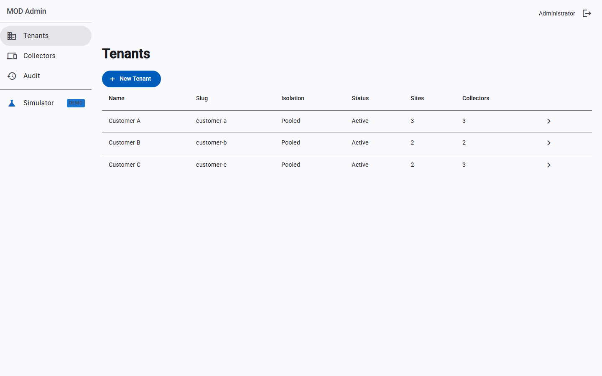
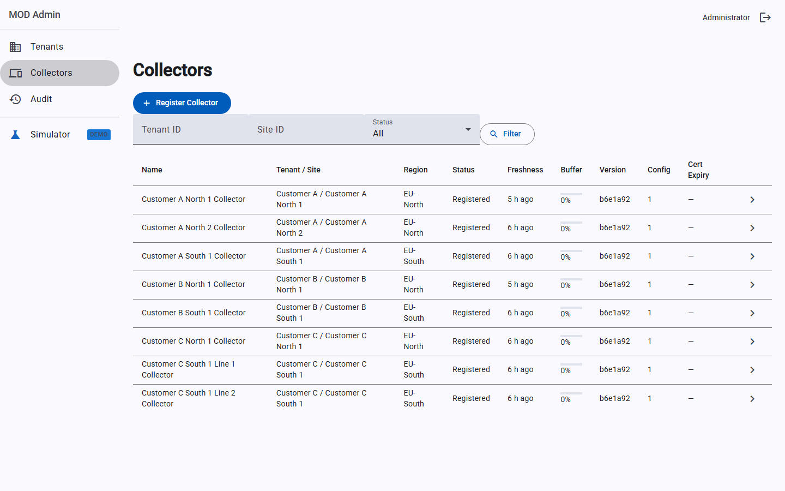
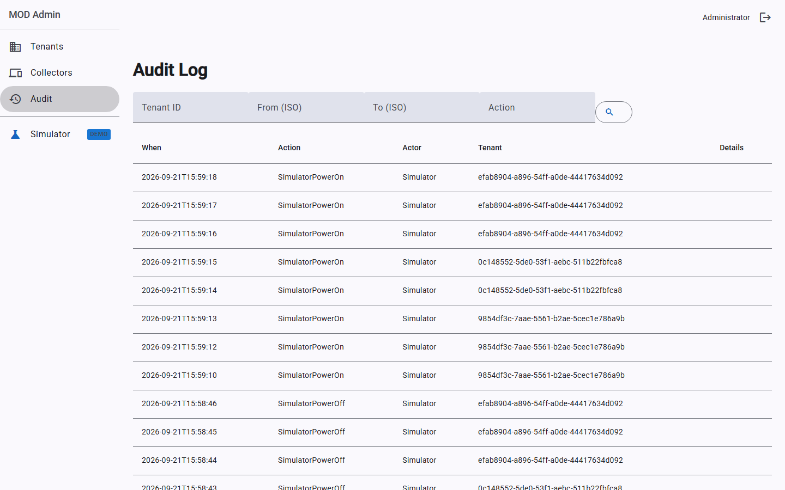
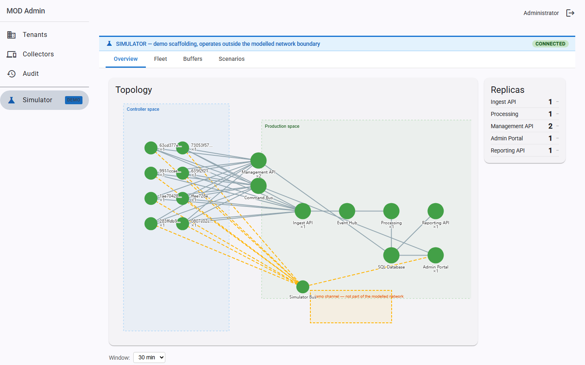
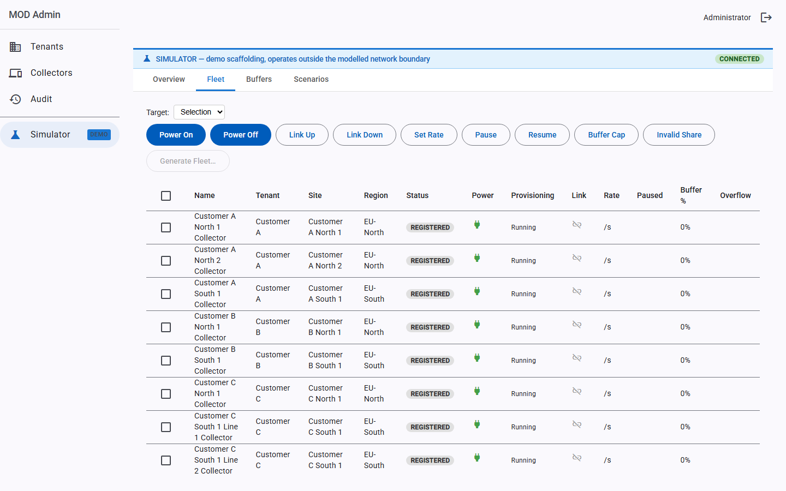
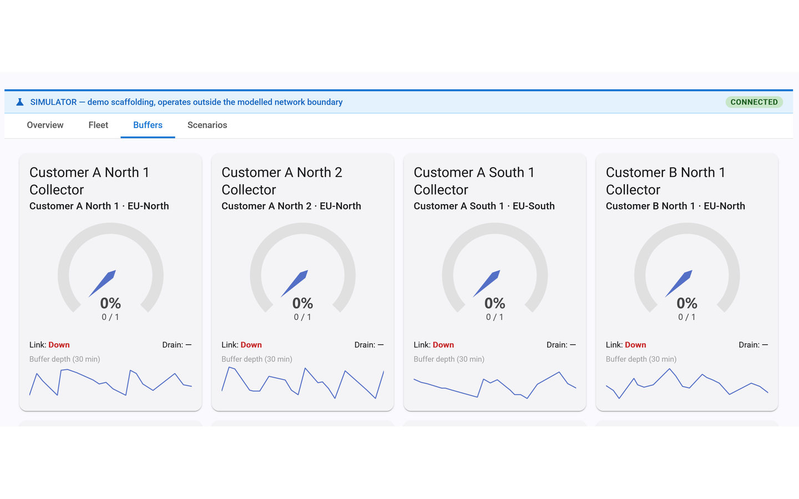
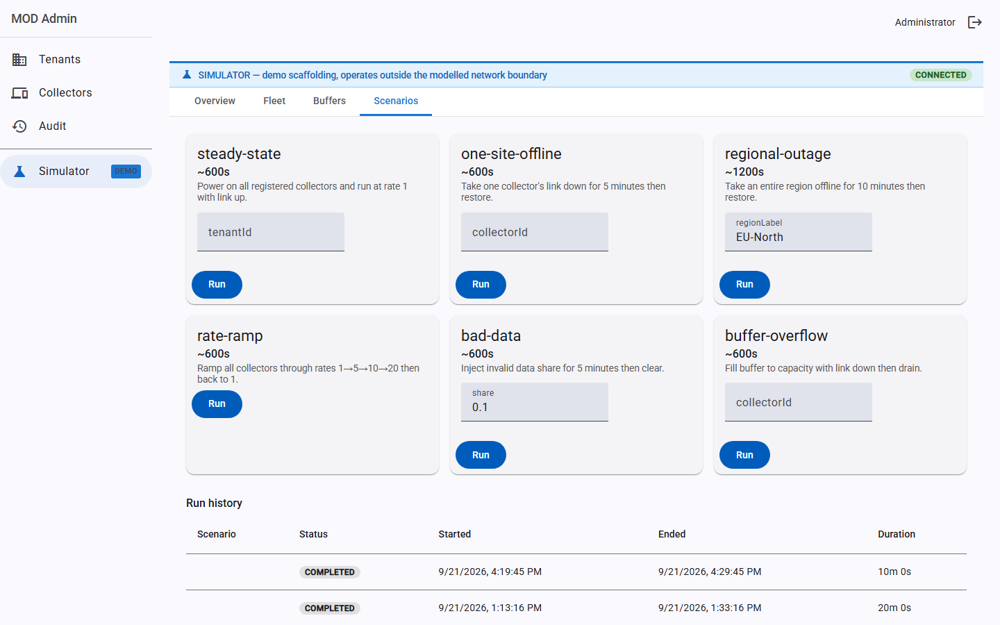
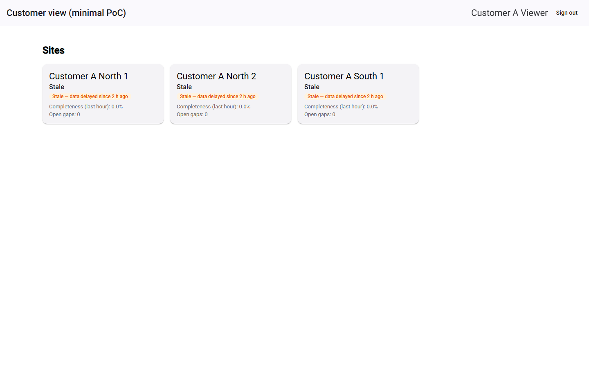

# Manufacturing Operational Data (MOD) — Cloud Platform PoC

A proof-of-concept of a cloud architecture for manufacturing operational data: simulated edge collectors stream counter and process-value events into an Azure ingest pipeline, where they are processed into per-minute rollups and surfaced to tenant-scoped customer portals with live push updates.

---

## What this PoC demonstrates

| Capability | How it works |
|---|---|
| **Edge-to-cloud telemetry** | Simulated collectors (one Container App each, North Europe) enrol with a one-time token, pull config, generate events from synthetic sources, buffer durably in SQLite, and forward compressed batches to the ingest API over mTLS. |
| **Layered tenant isolation** | JWT claim → EF Core query filter → SQL Server row-level security (`TenantId` context). Three independent layers — any one alone prevents cross-tenant reads. |
| **Event processing pipeline** | Ingest API accepts batches → Event Hubs → Processing service de-duplicates, validates, attributes, detects sequence gaps, computes per-minute rollups, and writes to Azure SQL. |
| **Live reporting** | Customer portal polls the reporting API for rollup charts; a SignalR hub pushes rollup updates in real time. |
| **Admin + simulator** | Admin portal manages tenants, collectors, audit, dead letters, restatements, and product commands. A simulator area (demo scaffolding) powers collectors on/off, runs unattended scenarios, and shows live metrics from all services. |
| **Certificate auth** | Collectors use client certificates issued by a PoC CA stored in Key Vault. Management API validates the cert on every request; collectors auto-renew before expiry. |

---

## Architecture (deployed)

```
Controller space (North Europe)
  col-* (8× Container Apps)  ← simulated collectors
        │ HTTPS/mTLS batch POST
        ▼
Production space (West Europe)
  ca-ingest       → Event Hub (eh-modpoc)
  ca-mgmt         ← collectors poll for config/health/cmd-channel
  ca-processing   ← reads Event Hub, writes Azure SQL
  ca-portal       ← admin portal + simulator API + Angular app
  ca-reporting    ← customer reporting API + Angular app
  sql-modpoc      ← Azure SQL (registry, telemetry, sim schemas)
  kv-modpoc       ← Key Vault (CA, JWT keys, SAS keys)
  sbcmd-modpoc    ← Service Bus (product command queues)
  sbsim-modpoc    ← Service Bus (simulator status/command)
  acrmodpoc       ← Container Registry (all images)
```

---

## What is working

- **Ingest pipeline end-to-end**: collectors enrolled, batches flowing at ~40 events/batch per collector, Event Hub receiving, processing service consuming and writing rollups to SQL.
- **Admin portal**: login, tenants list, collectors list, audit log with filters and pagination.
- **Simulator UI**: overview metrics (batches/s, EH lag, events/s), fleet table, buffers page with gauges, scenarios list.
- **Customer portal**: login, sites list with freshness/completeness/gap indicators, site detail, asset rollup chart (bar + line, with live updates via SignalR).
- **Tenant isolation**: confirmed — Customer A viewer sees only Customer A data.
- **Certificate auth + renewal**: mTLS on all collector→management-API calls.
- **Queue reconciliation**: admin portal auto-creates `cmd~` and `reply~` queues per enrolled collector.

## What is not working

| Issue | Root cause | Status |
|---|---|---|
| **Service Bus command channel** | `Put token failed 404` on AMQP CBS despite `AzureNamedKeyCredential` fix being deployed and key matching — exact cause unresolved | Not fixed |
| **Sim channel status** | `simStatus` is null for all running collectors — buffer depth, drain rate, and link state show 0/— in the Buffers page | Not fixed |
| **Customer portal freshness** | Processing service checkpoint was reset; it is catching up through the Event Hub backlog. `LastEventTime` ~1 h behind; will clear once caught up | Transient |
| **Completeness 0.0%** | Same backlog issue — `AcceptedCount` in `Reconciliation` not incrementing while de-duplicating already-seen events | Transient |

## Shortcuts / PoC departures

- **Local accounts** — username + password (BCrypt) instead of Entra External ID federation.
- **In-process SignalR** — no Azure SignalR Service; single-replica only.
- **Pooled tenancy only** — Dedicated tier exists in the UI but is disabled.
- **No Front Door / WAF** — services are publicly accessible.
- **Simulated sources** — synthetic counter + process-value generators instead of OPC-UA / Modbus PLCs.
- **File-based collector key** — private key written to disk; no HSM or TPM.
- **Ephemeral SQLite buffer** — lost on container restart; no durable ring buffer.
- **Exportable PoC CA** — CA private key stored in Key Vault; not suitable for production.
- **Unsigned command requests** — portal sends commands without a request signature.
- **No ADLS archive** — raw events stored in SQL columnstore only; no cold storage.
- **Processing delay knob** — artificial per-batch delay (`PROCESSING_DELAY_MS`) to make EH lag visible at small fleet sizes.
- **No update rings** — all collectors run the same image tag.

---

## Screenshots

### Admin portal — tenants dashboard



---

### Admin portal — collectors



---

### Admin portal — audit log



---

### Simulator — overview (live metrics)



---

### Simulator — fleet



---

### Simulator — buffers



---

### Simulator — scenarios



---

### Customer portal — sites dashboard


